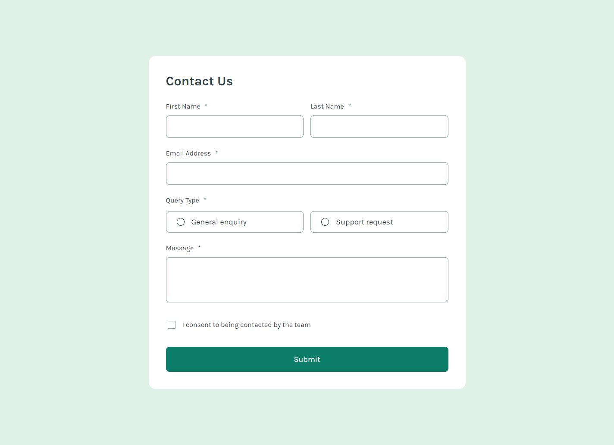
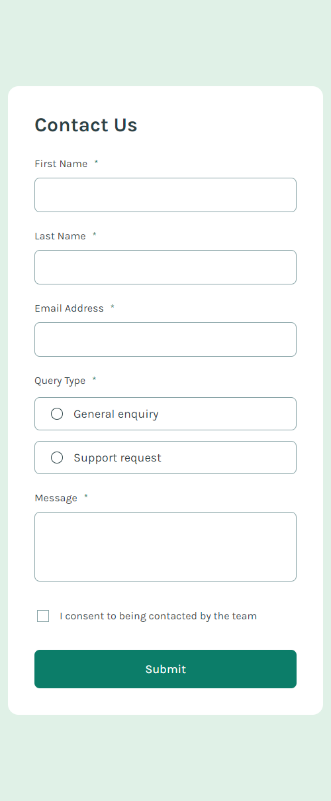

<h1 align="center" style="margin: 0">Contact Form</h1>

Solution to the Frontend Mentor challenge

This is a solution to the <a href="https://www.frontendmentor.io/challenges/contact-form--G-hYlqKJj">Contact Form challenge on Frontend Mentor</a>. Frontend Mentor challenges help you improve your coding skills by building realistic projects.

## Screenshots

### Desktop view

### Mobile view

## Links

- Live Site URL ⇒ https://contact-form-km.netlify.app

## Built with

- Angular v17
- SCSS

## Features

Users should be able to:

- Complete the form and see a success toast message upon successful submission
- Receive form validation messages if:
  - A required field has been missed
  - The email address is not formatted correctly
- Complete the form only using their keyboard
- Have inputs, error messages, and the success message announced on their screen reader
- View the optimal layout for the interface depending on their device's screen size
- See hover and focus states for all interactive elements on the page